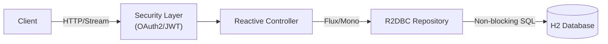

# 🚀 Reactive CRUD with Backpressure

> A High-Performance, Non-Blocking REST API built with Spring WebFlux, R2DBC, and OAuth2 Security.


## 📖 Overview

**crudreativeBackpressure** is a state-of-the-art implementations of a Reactive CRUD application. It leverages the full power of the **Spring Reactive Stack** to handle high concurrency with minimal resources. Unlike traditional blocking APIs, this project demonstrates how to build a fully non-blocking pipeline—from the controller down to the database.

Key advanced features include **Backpressure Management** for handling large data streams securely and robust **OAuth2/OIDC Security** integration using Keycloak.

## ✨ Key Features

- **⚡ Fully Reactive Stack**: End-to-end non-blocking I/O using Spring WebFlux and Netty.
- **🌊 Backpressure Handling**: Smart data streaming that respects client consumption rates using `onBackpressureBuffer`.
- **🛡️ Robust Security**: Secured via OAuth2 Resource Server (JWT) with Keycloak integration.
- **💾 Reactive Database Access**: High-performance database interactions using Spring Data R2DBC and H2.
- **✅ Data Validation**: Comprehensive uniqueness checks (e.g., Email Uniqueness validation on creation).
- **🧪 Testing**: Includes `curl` scripts for easy API verification.

## 🛠️ Technology Stack

| Component | Technology | Description |
|-----------|------------|-------------|
| **Core** | Java 17 | Latest LTS features. |
| **Framework** | Spring Boot & WebFlux | Reactive application framework. |
| **Database** | H2 (InMemory) | Fast, embedded SQL database. |
| **Persistence** | Spring Data R2DBC | Reactive Relational Database Connectivity. |
| **Security** | Spring Security OAuth2 | Resource Server with JWT validation. |
| **Identity** | Keycloak | OIDC/OAuth2 Provider (external dependency). |
| **Build** | Gradle | Dependency management and build automation. |

## ⚙️ Architecture

The application follows a reactive layered architecture:



- **Controller**: Handles HTTP requests non-blockingly.
- **Backpressure**: The `/users/stream` endpoint demonstrates `Buffer` strategies to prevent overwhelming the subscriber.
- **Error Handling**: Custom exception handling for business logic (e.g., `EmailUniquenessException`).

## 🚀 Getting Started

### Prerequisites

- **JDK 17** or higher installed.
- **H2 Database** (Embedded, no installation needed).
- **Keycloak Server** (Optional for full security features, running on port `8180`).
  - *Note: Without Keycloak, secured endpoints may return 401 Unauthorized.*

### Installation

1. **Clone the repository**
   ```bash
   git clone https://github.com/Juste120/crudreative_blackpressure.git
   cd crudreativeBackpressure
   ```

2. **Build the project**
   ```bash
   ./gradlew clean build
   ```

3. **Run the application**
   ```bash
   ./gradlew bootRun
   ```
   The app will start on `http://localhost:8080`.

## 🔐 Security Configuration

The application is configured as an **OAuth2 Resource Server**. It expects a Keycloak instance running locally.

**Key Settings (`application.properties`):**
- **Issuer/JWK Set URI**: Points to `http://localhost:8180/auth/realms/BookStoreRealm`.
- **Roles**:
  - `ROLE_ADMIN`: Required for `POST /users` (Create).
  - `ROLE_USER` / `ROLE_ADMIN`: Required for `GET /users/**` (Read).

> **Tip**: You can disable security for testing by modifying `SecurityConfig.java` or setting up a local Keycloak container with the `BookStoreRealm`.

## 🔌 API Endpoints

Base URL: `/users`

| Method | Endpoint | Description | Auth Required |
| :--- | :--- | :--- | :--- |
| `GET` | `/` | Retrieve all users | `USER` or `ADMIN` |
| `GET` | `/{id}` | Retrieve user by ID | `USER` or `ADMIN` |
| `POST` | `/` | Create a new user | `ADMIN` |
| `PUT` | `/` | Update an existing user | Authenticated |
| `DELETE` | `/{id}` | Delete a user | Authenticated |
| `GET` | `/stream` | **Stream users with Backpressure** | `USER` or `ADMIN` |

### Sample JSON Body
```json
{
  "name": "Alex Tech",
  "email": "alex.tech@example.com"
}
```

## 🧪 Testing

A convenient shell script is provided to test endpoints using `curl`.

1. Make the script executable:
   ```bash
   chmod +x test-curl.sh
   ```
2. Run the test suite:
   ```bash
   ./test-curl.sh
   ```

## 🤝 Contributing

Contributions are welcome! Please fork the repository and submit a Pull Request.

---
*Created by PAKOU Komi Juste*
